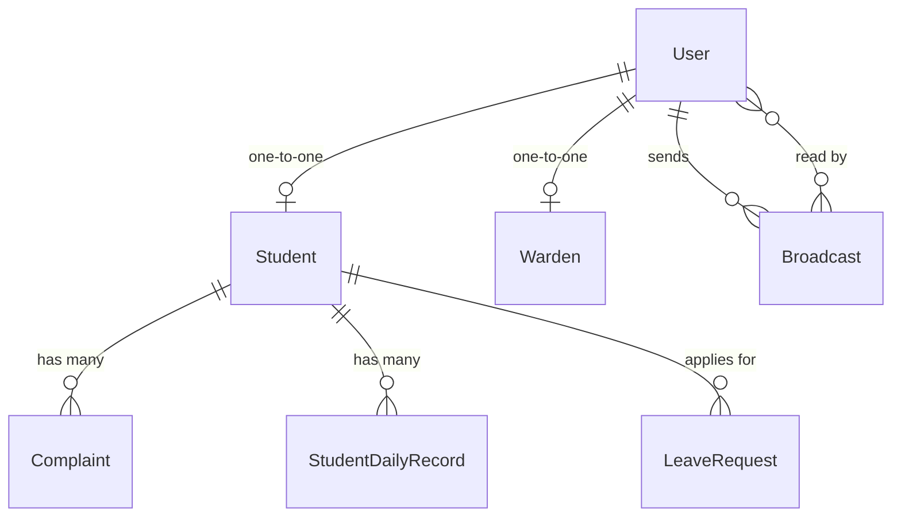

# Optimess — Smart Geofenced Hostel & Mess Management System

Optimess is a state-of-the-art, automated Hostel & Mess Management System engineered to solve logistics, waste management, and security challenges in student residential campuses. Powered by Django, Scikit-learn (Machine Learning), and SendGrid, Optimess provides a geofenced attendance verification system, automated parent alert workflows, and AI-driven meal demand/waste forecasting dashboards.

---

## 📌 Problem Solved

Traditional hostel administrative workflows suffer from severe inefficiencies:
* **Proxy and Fraudulent Attendance:** Students marking attendance while outside hostel premises or college boundaries.
* **Massive Food Wastage:** Mess managers struggle to predict student meal participation, leading to over-purchasing and high food wastage or sudden food shortages.
* **Manual and Siloed Communication:** Lack of unified, real-time channels to push urgent notifications to students, wardens, or mess managers.
* **Delayed Parent Notifications:** Parents are left uninformed when a student is absent from the hostel or has leave approved.
* **Administrative overhead:** Hand-written log books for leaves, complaints, and visitor controls.

**Optimess** eliminates these hurdles by combining GPS geolocation validation, regression-based meal demand forecasting, and automatic notification pipelines into a unified platform.

---

## 🚀 Advanced Core Features

### 📍 GPS Geofenced Attendance
Optimess implements client-side geolocation gathering verified against server-side validation. Using the **Haversine formula**, the system checks the student's exact coordinates against the campus center coordinates (`9.728714, 76.727813`). Attendance is only registered if the student is verified to be within a **350-meter campus radius**.

### 📈 AI-Driven Mess Analytics & Forecasting
* **Meal Demand Prediction:** Mess managers access a dashboard powered by Scikit-learn's `LinearRegression` model. The system predicts next-day meal requirements (Breakfast, Lunch, Dinner) based on weekly rolling metrics, reducing resource consumption.
* **Waste Trend Estimation:** Multi-dimensional bi-monthly tracking aggregates skip rates (students who opt out of meals) to compute active waste metrics. A regression algorithm predicts the next bi-monthly bucket's waste trend (categorized as *High*, *Moderate*, or *Low*).
* **Menu Suggestions:** Pushes recommendations based on student favorite dishes extracted from historical selection rates.

### ✉️ SendGrid Parent Notification Pipeline
Automated email alerts are sent to parents/guardians via SendGrid:
1. **Absence Alert:** Automatically triggered if a student marks themselves absent, or if the system's nightly batch script auto-closes the records as absent.
2. **Leave Approved Notification:** Sent immediately upon warden approval, detailing the approved leave duration.

### 🤖 Intelligent NLP Message Categorizers
* **ML Complaint/Suggestion Classifier:** When students file feedback, a zero-shot TF-IDF Vectorizer matches inputs with prototypical category descriptions (using cosine similarity) to auto-tag the category (*Electrical*, *Plumbing*, *Cleaning*, *Network*, *Food*, *Safety*, *General*) and type (*Complaint* vs. *Suggestion*).
* **ML Broadcast Classifier:** Pushed announcements are scanned and auto-categorized into *Urgent*, *Meeting*, *Announcement*, or *General* using similarity mapping, routing them to the correct dashboard section.

---

## 🛠️ Technology Stack & Frameworks

* **Backend Framework:** Django 5.2.3 (Python 3) using ASGI/WSGI configuration.
* **Databases:** MySQL (Production-ready via `mysqlclient`) & SQLite3 (Local development/testing).
* **Machine Learning & NLP:** Scikit-learn (TF-IDF Vectorization, Cosine Similarity, Linear Regression) and NumPy.
* **Notification APIs:** SendGrid Integration for secure transactional email delivery.
* **Security & Session Control:** Custom middleware preventing browser caching on authenticated pages and securing role-based dashboard redirection.
* **Frontend:** Vanilla HTML5/CSS3 (with dedicated `admin_theme.css` and `student_theme.css`), JavaScript (HTML5 Geolocation API, Chart.js integrations).

---

## 🏛️ Project Architecture & Module Structure

Optimess follows a highly modular Django application layout to enforce clean separation of concerns:

```
optimess/
├── accounts/               # User Authentication, NLP classifier models, Context processors
├── adminapp/               # Administrative controls, provisioning portal, global reports
├── food/                   # Geofenced attendance routing, Daily menus, automation commands
├── leave/                  # Student Leave request workflow (apply, cancel, modify, history)
├── mess_manager/           # Mess dashboard, menu editor, ML statistics, seeding commands
├── optimess/               # Project configuration, URLs, middleware routing, settings.py
├── reports/                # Reporting placeholders and analytics export modules
├── warden/                 # Block-scoped warden actions (approvals, attendance, profile controls)
├── templates/              # Role-specific HTML files (student, warden, mess_manager, admin)
├── static/                 # Stylesheets (admin_theme.css, student_theme.css), UI assets
├── requirements.txt        # Backend dependencies manifest
└── manage.py               # Django execution CLI script
```

### Role-Based Access Control (RBAC) Matrix

| User Role | Geofenced Attendance | Leave Controls | Mess Management & Menu Edits | NLP Feedback & Auto Tagging | User Account Provisioning | Analytics & Reports |
| :--- | :---: | :---: | :---: | :---: | :---: | :---: |
| **Student** | ✔️ (Self-mark) | ✔️ (Apply/Modify) | ✔️ (Daily choices) | ✔️ (Submit Feedback) | ❌ | ❌ |
| **Warden** | ✔️ (Mark/Verify Block) | ✔️ (Approve/Reject Block) | ✔️ (Edit Block choices) | ✔️ (Resolve Complaints) | ❌ | ✔️ (Block metrics) |
| **Mess Manager** | ❌ | ❌ | ✔️ (Edit menus, AI recommendations) | ❌ | ❌ | ✔️ (Demand/Waste forecast) |
| **Admin** | ❌ | ✔️ (View only) | ❌ | ❌ | ✔️ (Create/Manage accounts) | ✔️ (Global reports) |

---

## ⚙️ Setup and Installation

### Prerequisites
* Python 3.10+
* MySQL Server (optional, defaults to SQLite3)
* SendGrid API Key (for email functionality)

### Installation Steps

1. **Clone the Repository:**
   ```bash
   git clone https://github.com/DevaNandaSManoj/Mini_project.git
   cd Mini_project
   ```

2. **Configure Virtual Environment:**
   ```bash
   python -m venv venv
   # On Windows:
   .\venv\Scripts\activate
   # On macOS/Linux:
   source venv/bin/activate
   ```

3. **Install Dependencies:**
   ```bash
   pip install -r requirements.txt
   ```

4. **Set Up Environment Variables:**
   Create a `.env` file in the root directory:
   ```env
   SECRET_KEY=your-django-secret-key
   DEBUG=True
   SENDGRID_API_KEY=SG.your-sendgrid-api-key
   ```

5. **Execute Database Migrations:**
   ```bash
   python manage.py makemigrations
   python manage.py migrate
   ```

6. **Seed Test Attendance Data:**
   Use the custom management command to seed mock student attendance from April 6, 2026, to today:
   ```bash
   python manage.py seed_attendance --force
   ```

7. **Create Administrator Account:**
   ```bash
   python manage.py createsuperuser
   ```

8. **Start the Development Server:**
   ```bash
   python manage.py runserver
   ```
   Open your browser and navigate to `http://127.0.0.1:8000/`.

---

## 🤖 Automation Workflows & Cron Jobs

Optimess automates routine background checks via custom Django management commands. In production, these should be scheduled using **cron** or **celery-beat**:

* **`generate_daily_records`**
  * Run daily at 12:01 AM.
  * Generates next-day food records and today's blank attendance records for all active students.
* **`close_daily_records`**
  * Run daily at 11:59 PM.
  * Automatically sets unmarked attendance for the day to `Absent` (marked by `auto`).
  * Closes and locks meal selections for the current day, defaulting unmarked options to `False`.

---

## 📊 Database Configurations & Models

### Core Models Relation


* **`accounts.User`**: Inherits from Django's `AbstractUser`, extending it with a `role` field (`student`, `warden`, `mess`, `admin`).
* **`accounts.Student`**: Stores hostel block, room number, contact info, parental email, and profile details.
* **`food.DailyMenu`**: Represents a daily menu containing text fields for breakfast, lunch, and dinner.
* **`food.StudentDailyRecord`**: Tracks present/absent status and breakfast/lunch/dinner selections, including which authority marked the record (`student`, `warden`, `auto`).

---

## 🖼️ User Interface Mockups & Flow

### 1. Geofenced Student Check-in
```
+-------------------------------------------------------------+
|                     OPTIMESS STUDENT PORTAL                 |
+-------------------------------------------------------------+
|                                                             |
|   [📍 Fetching GPS Location...]                             |
|   🌐 Geolocation Status: Inside College Bounds (Allowed)     |
|                                                             |
|   Mark Today's Attendance:                                  |
|   +-------------------+    +------------------+             |
|   |    [ PRESENT ]    |    |    [ ABSENT ]    |             |
|   +-------------------+    +------------------+             |
|                                                             |
+-------------------------------------------------------------+
```

### 2. Warden Dashboard (Block Scope)
```
+-------------------------------------------------------------+
| WARDEN BLOCK A - DASHBOARD                                  |
+-------------------------------------------------------------+
|  Total Students: 120   |   Pending Leaves: 3   |  Attn: 94% |
+-------------------------------------------------------------+
|  Pending Approvals:                                         |
|  - Student: John Doe | 24 Jun -> 28 Jun | [Approve] [Reject]|
|                                                             |
|  Unresolved Feedback:                                       |
|  - Room 204: Wi-Fi router down [Type: Network]  [Resolve]   |
+-------------------------------------------------------------+
```

### 3. Mess Manager Analytics & ML Forecasts
```
+-------------------------------------------------------------+
| MESS ANALYTICS ENGINE                                       |
+-------------------------------------------------------------+
|  Tomorrow's Meal Bookings:                                  |
|  🍳 Breakfast: 89     | 🍲 Lunch: 110      | 🍛 Dinner: 95   |
+-------------------------------------------------------------+
|  🧠 ML Predictive Forecasts (Next Day):                     |
|  📈 Expected Breakfast: 94   | Expected Lunch: 114          |
|                                                             |
|  Smart Waste Index: [ Moderate (65 skipped portions) ]      |
+-------------------------------------------------------------+
```

---

## 🔮 Future Enhancements

* **SMS Gateway Integration:** Send SMS updates directly to parent phone numbers alongside email alerts.
* **Real-time Wi-Fi Handshake Verification:** Fallback geolocation validation check via college router MAC addresses.
* **Deep Learning Classifier Upgrade:** Moving from TF-IDF Cosine Similarity to a local lightweight BERT model for complex feedback translation and sentiment evaluation.
* **Auto-generated Shopping Lists:** Mess managers receive automatic grocery purchase volume predictions based on forecasted meal counts.

---

## 👥 Contributors

* **Deva Nanda (DevaNandaSManoj)** — Core Architecture & Database design
* **Amritha Sanjiv (Amritha)** — ML Classifiers, Geofencing, and Front-end Themes
* **Smitha Vadakumcheril (Smitha)** — Leave Workflows & Automated SendGrid pipelines
* **Alsa Binu** — Collaborative development & validation
